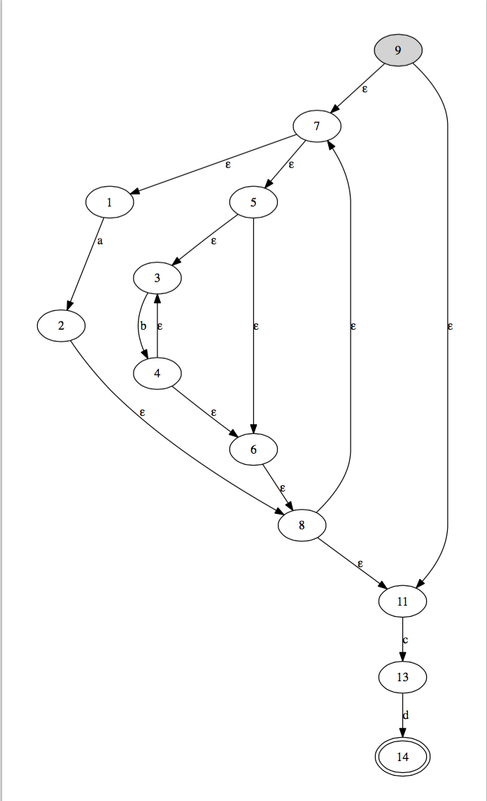

###PLP Homework
######*Antonio Mallia (423458)*

####Grammatica
```no-highlight
RExp -> Exp EOL
Exp -> SExp | SExp PIPE Exp
SExp -> Term | Term SExp
Term -> Fact | Fact Start  
Fact -> P_OPEN Exp P_CLOSE | CHAR 
CHAR -> a|...|z|A|...|Z|0|...|9
PIPE -> "|"
STAR -> "*"
P_OPEN -> "("
P_CLOSE -> ")"
EOL -> "\n\r"
```

####Istruzioni

- Compilazione
	``make``

- Esecuzione
	``make run``
	Inserire la regular expression e terminare con invio.

- Generazione PDF
	``make pdf``
	Viene generato il pdf e aperto in automato dal visualizzatore di sistema.

#####Output di Esempio
``(a|b*)*cd ``


